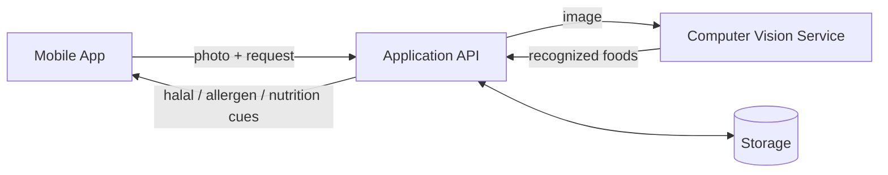

  

<h1 align="center">EATH</h1>

  <strong>Point your camera at a meal. EATH reads the photo and surfaces dietary indications to consider before you eat.</strong>

  
  &nbsp;
  
  &nbsp;
  

  <a href="#why-eath">Why</a> ·
  <a href="#what-eath-indicates">What it indicates</a> ·
  <a href="#features">Features</a> ·
  <a href="#how-it-works">How it works</a> ·
  <a href="#screenshots">Screenshots</a> ·
  <a href="#disclaimer">Disclaimer</a>

---

> **EATH is an informational aid, not a certification.**
> It works only from what is visible in a single photo, and its results can be **incomplete or wrong**.
> It cannot detect hidden ingredients, allergen traces, cross-contamination, or method of slaughter.
> **Never rely on EATH for medical, allergy, or religious decisions.** Please read the [Disclaimer](#disclaimer).

**EATH** is a mobile app that analyzes a meal from a single photo and surfaces dietary cues before you eat: possible **halal** concerns, potential **allergens**, and an estimated **nutritional** profile. It recognizes the foods it can see in the image and turns them into readable indications meant to prompt your own verification — not to replace it.

 

## Why EATH

Eating well means different things to different people — a religious requirement, a serious allergy, a health goal. Reading labels is slow, and a plate of cooked food has no label at all. EATH helps narrow that gap: it looks at the meal itself and raises questions worth verifying about a dish.

It is built to **inform a decision, never to make it for you.** EATH reports what it can recognize from the image, and is explicit about what it cannot see — so you know when, and what, to verify independently. Because it reasons from a photo alone, it can miss things or be wrong, and every result should be treated as a prompt to check, not as a confirmation.

 

## What EATH Indicates

Depending on the foods EATH recognizes, a scan can surface up to three indications, each derived from what it visually recognizes. Every axis comes with its limits.

| Indication | What it offers | What it cannot do |
| :--- | :--- | :--- |
| **Halal cues** | Surfaces potential concerns derived from visibly recognized foods so you can verify them. | Has no knowledge of the method of slaughter, ingredient sourcing, or hidden/processed ingredients. It is **not** a halal certification, authentication, or confirmation, and any status it shows must be independently verified. |
| **Allergen cues** | Highlights potential allergens commonly associated with the recognized foods. | Cannot detect hidden ingredients, traces, cross-contamination, or allergens in sauces and preparations. Must **never** be relied on for medical or allergy safety. |
| **Nutrition estimate** | Provides an approximate nutritional profile based on recognized foods. | Portion sizes and values are **estimated** and depend on recognition; they are indicative, not measured. |

> All results are probabilistic indications drawn from what is visible in the photo. **They can be incomplete or wrong, and must be verified before you act on them.**

 

## Features

This list reflects what the mobile app does today.

| Feature | What it does |
| :--- | :--- |
| **Scan a meal** | Capture a photo (camera or gallery) and get an analysis of the recognized foods. |
| **Halal / allergen / nutrition cues** | Depending on the recognized foods, a scan can surface up to three indications. |
| **Scan history** | Review your past analyses at any time. |
| **Favorites** | Save the meals you scan most often for quick access. |
| **Error reporting** | Flag an incorrect halal, allergen, or nutrition result to help improve the app. |
| **Authenticated accounts** | Personal data is tied to an authenticated account. |

 

## Screenshots

  

  EATH on the App Store (MVP)

<!-- In-app captures (scan / result / account) to add later: commit to profile/assets/ and use absolute raw URLs.
     Do NOT use a capture showing a binary green/red halal verdict until the result screen is reframed as cues. -->

 

## How It Works

EATH is built as three cooperating components.

1. **You take a photo** in the mobile app (camera or gallery).
2. The **computer vision service** performs food recognition on the image. It can recognize **103 food categories** — whole foods (fruits, vegetables, seafood, meats) and common prepared dishes — above a confidence threshold.
3. The **application API** combines the recognized foods with dietary mapping and nutritional data to derive the halal, allergen, and nutrition indications, and manages authenticated accounts.
4. The app shows a readable result for the recognized foods.

> Recognition is bounded by the 103 known categories and a confidence threshold: foods outside that set, or items that are not clearly visible, may not be picked up — and may be misidentified.

 

## Tech Stack

Described at the technology-family level. Internal infrastructure details are intentionally not exposed here.

| Layer | Technology family |
| :--- | :--- |
| **Mobile app** | Cross-platform mobile (Flutter / Dart), iOS and Android |
| **Application API** | Java / Spring Boot backend |
| **Computer vision** | Python service running an object-detection model |
| **Infrastructure** | Containerized, cloud-ready |
| **Accounts** | Authenticated user accounts |

 

## Project Status & Directions

EATH is under **active development.**

**Available in the app today:** scan a meal from a photo (camera or gallery), receive halal / allergen / nutrition indications for the recognized foods, review your scan history, save favorites, report an incorrect result, and use an authenticated account.

**Planned, not yet delivered:**

- Reframing on-screen results purely as cues to verify, with a permanent per-result disclaimer.
- Broader food coverage beyond the current 103 categories.
- Richer nutritional detail.
- Improved recognition accuracy, informed by user error reports.

> These are directions, not commitments or release dates.

 

## About This Organization

This is the home of the **EATH** project. The application and service repositories are private; this page is the public overview of what we are building.

For partnership, press, or recruitment inquiries, please reach out to the team.

 

## Disclaimer

**DISCLAIMER — IMPORTANT, PLEASE READ**

EATH is an informational aid based on automated image recognition. It is **NOT** a medical device, **NOT** a dietary or nutritional advisory service, and **NOT** a halal certification, authentication, or religious ruling of any kind. EATH does not guarantee, certify, or verify that any food is halal, allergen-free, or safe for you to eat.

**How EATH works — and its limits.** EATH analyzes only what is visually recognizable in a single photo, within a fixed set of **103 food categories** and above a confidence threshold. Recognition can be incomplete, partial, or simply wrong. Because it works from an image alone, EATH **CANNOT** detect:

- hidden, processed, or sub-ingredients, additives, seasonings, or oils;
- allergen traces, residues, or cross-contamination during preparation, cooking, or serving;
- allergens contained in sauces, marinades, broths, fillings, or any non-visible preparation;
- the origin of ingredients or the method of slaughter relevant to halal status;
- foods outside its 103 known categories or items not clearly visible in the photo.

All outputs are probabilistic indications, not verdicts, and are provided strictly for general informational purposes.

**ALLERGIES AND MEDICAL SAFETY.** If you have a food allergy or intolerance, **NEVER** rely on EATH to decide whether a food is safe. An undetected allergen can cause serious or life-threatening reactions. Always confirm independently — through ingredient labels, the establishment or cook, packaging, and where relevant a qualified healthcare professional — before eating. EATH is not a substitute for professional medical advice; in an emergency, contact emergency services.

**HALAL AND RELIGIOUS COMPLIANCE.** EATH cannot establish, confirm, or certify the halal status of any food. It has no knowledge of slaughter method, ingredient sourcing, certification, or preparation. For any religious dietary requirement, rely only on competent religious authorities, trusted certification bodies, and the establishment — not on EATH.

**NO WARRANTY.** To the fullest extent permitted by applicable law, EATH and its results are provided **"AS IS"** and **"AS AVAILABLE"**, without warranties of any kind, whether express or implied, including but not limited to accuracy, completeness, fitness for a particular purpose, or non-infringement. You use EATH at your own discretion and risk, and you remain solely responsible for your dietary, health, and religious decisions. To the maximum extent permitted by applicable law, the EATH team disclaims liability for any harm, loss, or damage arising from reliance on EATH's outputs.

This public page is a project overview for informational purposes only and does not constitute a contract, offer, warranty, or professional advice. The binding terms governing use of the EATH application are the in-app Terms of Use / EULA and Privacy Policy presented at installation or first use.

---

  EATH — meal analysis from a photo, as informational cues to verify, never a guarantee.

